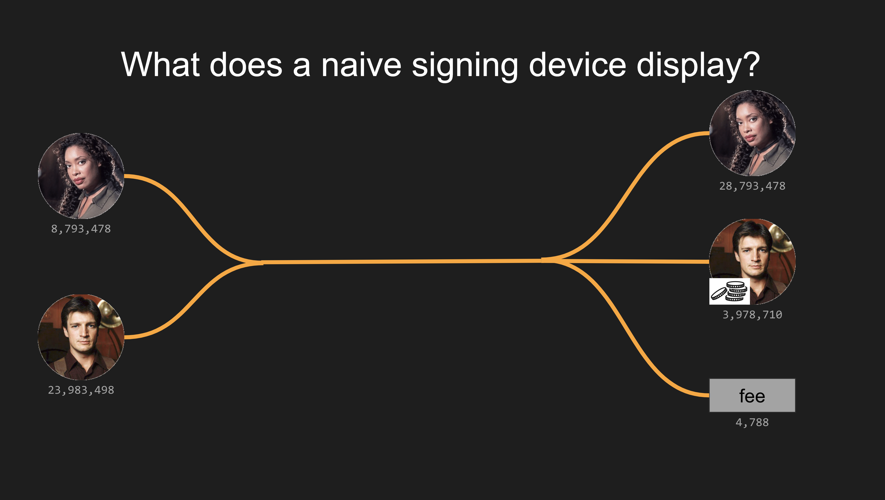
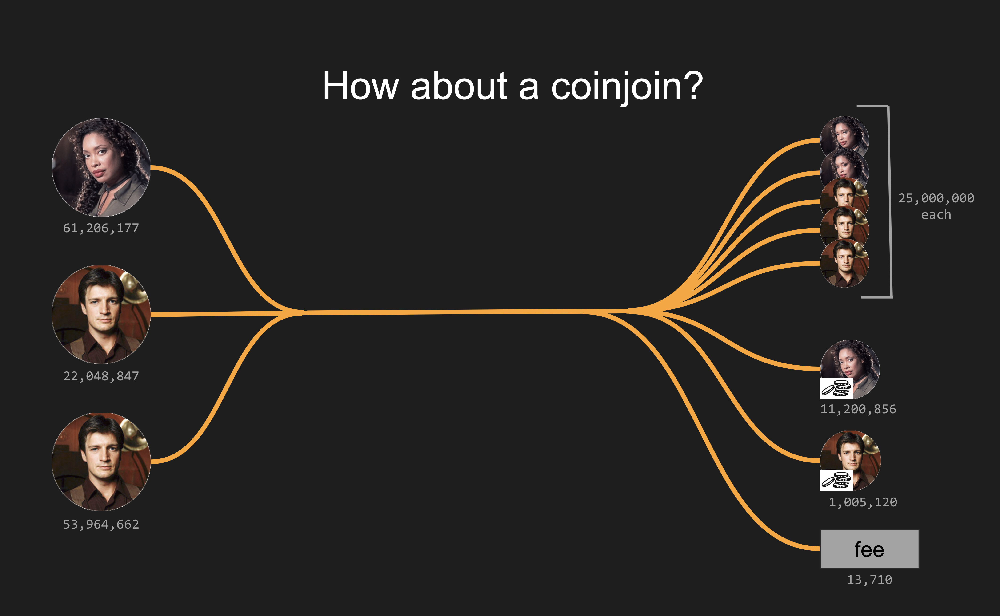
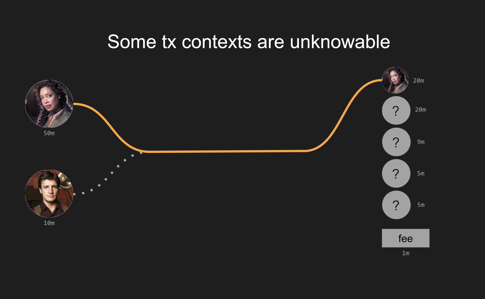

# Cooperative Spend UI/UX Challenges

Discussing the challenges hardware wallets / signing devices face when presenting payjoins, coinjoins, and more complex cooperative spends (a transaction where at least two people contribute an input).

Exploration of current devices' flawed approaches, work-in-progress UI/UX improvement possibilities, and concludes with a work-in-progress cheat sheet to guide other designers.

[Chicago BitDevs presentation](https://chibitdevs.org/2024-02-08-Socratic-Seminar-51), Feb 2024





# Slides

Apologies, I authored the slides in Google Slides so they're best viewed there:

https://docs.google.com/presentation/d/1BZooMjRR5SseIxelsxrXPtK5JU995bprfU41XHlGL30/edit?usp=sharing

I also exported the slides:
* [cooperative_spends_uiux.pptx](cooperative_spends_uiux.pptx) PowerPoint file (untested)
* [cooperative_spends_uiux.pdf](cooperative_spends_uiux.pdf) PDF (which does a bad job with the slides w/animated callouts)


# UI/UX Cheat Sheet
(work-in-progress; definitely not confident these heuristics are dependable)

Given a tx with 1+ input from you and 1+ external input...

**Payjoin receive:**
```
your outputs > your inputs
```
You're receiving more from the tx than you contributed.

---

**Payjoin send:**
```
your inputs = (their outputs - their inputs) + fee
```
The other party is getting all of their inputs' sats back PLUS additional sats from you AND you're paying the full fee.

---

**Coinjoin:**

(lower confidence in this heuristic)
```
your inputs - your outputs* <= fee
```
_(where 1 or more of your outputs is the same size as at least 1 other recipient; assumes the fee is smaller than the smallest output)_

Equal-size output coinjoin where you are mixing and receiving just your own sats (the other participants don't contribute any sats to your outputs). You might be paying zero part of the fee, a portion of the fee, or the entirety of the fee.

---

**Complex / Ambiguous:**

(lowest level of confidence in this heuristic!!)
```
your inputs - your outputs > fee
```
_(where there are 2 or more outputs to other recipients)_

In an ambiguous cooperative spend, there's no way to know the context. All we know for sure is that some of your sats are funding at least one of the other recipients. But we cannot tell just from the tx structure WHICH output(s) you are intending to fund.

---





